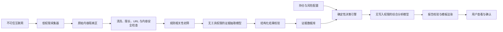

# ETF 投资分析工具实施计划

> 文档状态：第一版实施基线  
> 更新时间：2026-07-17  
> 目标读者：产品负责人、开发人员、测试人员、部署维护人员  
> 当前阶段：方案完成，尚未开始业务代码开发

## 1. 文档目的

本文档用于指导一个面向个人使用的 ETF 投资决策支持工具从零搭建。计划将工作拆分为可独立验收的步骤，并在每一步同时考虑：

- 功能是否形成最小可用闭环；
- 后续增加 ETF、主题、信息源、AI 模型和部署方式时是否容易扩展；
- 外部网页、AI、API、跨境网络和个人持仓数据带来的安全风险；
- 当前环境不支持某项技术时是否存在低成本替代方案；
- AI 结论是否有证据、可追溯、可拒绝回答，且不会自动交易。

本文档不是收益承诺，也不把 AI 输出视为专业投资顾问意见。工具的定位是“有证据、可解释的个人决策支持系统”。

---

## 2. 已确认需求

### 2.1 用户与投资场景

- 用户是投资新手，缺少专业金融背景；
- 初始投资本金约 3,000 元，短期内不急用；
- 当前阶段不投资个股，只考虑 ETF 或支付宝中的 ETF 联接/指数基金；
- 当前关注范围包括半导体、黄金、中证 500、沪深 300、人工智能；
- 第一版只选择一个半导体相关产品作为试验对象；
- 需要综合全球新闻、官方信息、行业数据及未来可扩展的市场情绪；
- 最终希望得到观察、持有、小额加仓、暂停加仓、再平衡或降低仓位等建议；
- 不允许工具自动登录支付宝或自动交易。

### 2.2 第一版信息范围

第一版不追求全面，只接入两个示例信息源：

1. GDELT：用于发现全球半导体、存储、铜价、消费电子相关新闻；
2. SEC/代表性公司正式披露：用于验证部分行业信息和公司正式事实。

后续在获得具体基金代码后，再接入对应基金公司、指数公司或国内官方数据源。

### 2.3 更新周期

- 自动抓取周期：每 3 小时一次；
- 每日最多 8 个常规抓取周期；
- 支持人工手动刷新；
- 没有新相关信息时不调用 AI；
- 数据连续 6～8 小时未成功更新时显示“可能过期”；
- 抓取失败必须显式显示，不能用旧数据冒充最新数据。

---

## 3. MVP 范围

### 3.1 第一版必须完成

- 手工录入一个半导体基金和持仓；
- 保存个人风险约束和操作上限；
- 配置并运行两个示例信息源；
- 每 3 小时增量抓取；
- 原始信息留痕；
- URL 安全检查、内容限长、清洗和去重；
- 主题相关性筛选；
- AI 结构化抽取事实、观点、方向和不确定性；
- 证据可信度、直接程度、新鲜度和独立性评分；
- 确定性规则引擎生成允许的动作范围；
- AI 在动作范围内综合解释多空证据；
- 生成带来源、置信度和失效条件的报告；
- 展示任务状态、数据源状态和历史报告；
- 设置调用次数和 Token/费用上限；
- 影子运行：先观察建议，不自动执行交易。

### 3.2 第一版明确不做

- 自动登录支付宝；
- 自动下单、自动申购或赎回；
- 分钟级或实时行情；
- 全网全文抓取；
- 任意域名 PDF、压缩包和附件解析；
- 大规模社交媒体抓取；
- 多用户正式运营；
- 动态上传并执行第三方 Python 插件；
- Redis、Kafka、Elasticsearch、向量数据库等非必要基础设施；
- 收益承诺或“预测明日涨跌”。

---

## 4. 总体设计原则

### 4.1 模块化单体优先

第一版使用一个代码仓库和一套领域模型，但按模块定义清晰接口。部署时可以是一个或少量进程；后续某个模块负载或网络要求变化时，再拆成独立服务。

### 4.2 领域逻辑不绑定主题

“半导体”只是第一版配置，不得写死在核心业务流程中。核心对象使用通用的 `Asset`、`Topic`、`Entity`、`Exposure`、`Evidence`、`Decision` 和 `Report`。

### 4.3 外部内容一律不可信

来自 GDELT、新闻网页、RSS、PDF、邮件和用户上传文件的内容均视为不可信输入。它们不能直接获得系统指令、持仓详情、密钥、数据库写权限或工具调用权限。

### 4.4 AI 不负责最终权限

- AI 负责信息抽取、冲突整理、因果分析和自然语言解释；
- 硬性风险边界、仓位上限和操作金额由确定性规则计算；
- AI 输出越界时，以规则引擎为准；
- AI 无法确认时必须返回 `unknown` 或 `INSUFFICIENT_DATA`；
- AI 永远没有交易权限。

### 4.5 全链路可追溯

每份报告必须可以追溯到：

- 原始文档；
- 信息来源和发布时间；
- 结构化证据；
- 证据评分；
- 持仓快照；
- 决策规则版本；
- Prompt 版本；
- AI 提供商和模型；
- 报告生成时间。

### 4.6 默认安全失败

数据过期、来源失败、结构化输出错误、引用不存在或规则冲突时，系统应停止生成新建议并显示原因，不得静默降级为看似正常的报告。

---

## 5. 建议技术栈

| 领域 | 首选方案 | 第一替代方案 | 备注 |
|---|---|---|---|
| 编程语言 | Python 3.12 | 当前可维护的 Python 3.11+ | 开发时锁定准确版本 |
| Web 后端 | FastAPI | Flask | API 从 `/api/v1` 开始 |
| 页面 | Jinja2 + HTMX/少量 JS | Streamlit | 页面必须与业务服务解耦 |
| 数据校验 | Pydantic | JSON Schema 手工校验 | 所有跨模块对象必须校验 |
| ORM | SQLAlchemy | 直接 SQL | 禁止字符串拼接 SQL |
| 数据库迁移 | Alembic | 手工迁移脚本 | 每次结构变化需可回滚 |
| MVP 数据库 | SQLite | PostgreSQL | 云端/多进程稳定版用 PostgreSQL |
| HTTP 客户端 | httpx | requests | 必须统一超时、重试、代理和限速 |
| RSS | feedparser | 自行解析 XML | 统一输出 RawDocument |
| 正文提取 | trafilatura | 仅保存标题和摘要 | 任意全文抓取不在第一版范围 |
| 调度 | APScheduler | Windows 任务计划/Cron | 定时任务与 Web 请求解耦 |
| AI 接口 | 可替换 AIProvider | 纯规则模式 | 模型名通过配置注入 |
| 测试 | pytest | unittest | 使用固定样例，不依赖实时网络 |
| 部署 | Docker Compose | Python 虚拟环境 | 当前不强制微服务 |

---

## 6. 目标架构与可信边界



### 6.1 权限分离要求

- 采集器：可访问白名单外网；不能访问 AI 密钥和完整持仓；
- AI 抽取模块：只能接收已清洗文本；无网络工具、数据库写入和交易权限；
- 决策引擎：读取证据和持仓，在本地计算；
- 综合模型：只读取结构化证据和持仓比例摘要；不接收姓名、账号、密钥或完整交易明细；
- Web：不能代替采集器访问任意 URL；
- 数据库：不开放公网端口；
- 管理接口：不直接暴露公网或必须使用强认证。

---

## 7. 通用领域对象与模块接口

### 7.1 核心领域对象

```text
InvestmentProfile
Position
Asset
Topic
Entity
Exposure
Source
RawDocument
EventCluster
Evidence
EvidenceScore
DecisionContext
DecisionResult
AnalysisResult
Report
JobRun
```

### 7.2 核心可替换接口

```text
SourceAdapter          信息源接入
MarketDataProvider     基金、指数和行情数据
AIProvider             AI 证据抽取与综合分析
DecisionPolicy         风险和动作规则
ReportRenderer         HTML/Markdown/PDF 报告
NotificationProvider   站内、邮件或其他通知
TaskDispatcher         本地任务或未来队列
StorageProvider        数据库和对象存储
```

### 7.3 接口稳定性要求

- 输入输出使用 Pydantic/JSON Schema；
- 所有持久化对象包含 `schema_version`；
- 所有分析结果包含 `pipeline_version`、`rule_version` 和 `prompt_version`；
- 模块不得依赖其他模块的内部数据库实现；
- 新增适配器不得修改决策引擎；
- 新增 AI 提供商不得修改报告模板；
- 不允许从配置文件动态执行任意 Python 代码。

---

## 8. 建议目录结构

```text
investment-analysis-tool/
├─ app/
│  ├─ api/                 # /api/v1 接口
│  ├─ domain/              # 通用领域对象和枚举
│  ├─ application/         # 用例编排
│  ├─ collectors/          # SourceAdapter 及安全抓取
│  ├─ processing/          # 清洗、去重、分类
│  ├─ evidence/            # 证据抽取和评分
│  ├─ decision/            # 确定性规则
│  ├─ ai/                  # AIProvider 和 Prompt
│  ├─ reports/             # 报告校验和渲染
│  ├─ jobs/                # 定时任务和运行记录
│  ├─ storage/             # ORM、迁移、仓储接口
│  ├─ security/            # URL、内容、鉴权和审计
│  ├─ ui/                  # 页面模板和静态资源
│  └─ config/              # 类型化配置加载
├─ migrations/
├─ tests/
│  ├─ fixtures/
│  ├─ unit/
│  ├─ integration/
│  ├─ security/
│  └─ evaluation/
├─ docs/
├─ scripts/
├─ .env.example
├─ pyproject.toml
├─ docker-compose.yml
└─ plan.md
```

目录只规定职责，不要求第一天创建全部空文件。

---

## 9. 分步实施计划

## 步骤 0：冻结第一版业务参数

### 目标

在开始编码前消除会改变数据结构和决策规则的关键不确定性。

### 具体任务

- 获取第一只半导体产品的准确基金代码、名称和份额类型；
- 确认它是场内 ETF、ETF 联接还是普通场外指数基金；
- 记录持仓金额、成本、买入日期和当前市值；
- 确认最大可接受回撤；
- 确认单次最大操作金额；
- 确认是否有每月新增投资资金；
- 确认第一版 AI 提供商是否可用；
- 确认是否有可长期运行且能访问境外来源的服务器；
- 确认第一版仅供个人使用，不对公众提供投资建议服务。

### 交付物

- `MVP 参数表`；
- 第一只试验基金记录；
- 风险约束记录；
- 部署环境决定；
- AI 提供商决定或纯规则替代方案。

### 安全检查

- 不收集支付宝密码；
- 不收集与分析无关的身份信息；
- 不将真实密钥写入需求文档。

### 扩展性检查

- 基金使用通用 Asset/Position 表示；
- 半导体使用 Topic 配置表示；
- 不在核心逻辑中写死产品名称。

### 验收标准

- 所有关键业务参数都有明确值，或有被接受的默认值；
- 尚未确认的参数被标记为“阻塞”或“可后补”。

### 替代方案

- 暂无真实基金信息时，使用明确标记的模拟持仓；
- 暂无 AI 时，先完成纯规则和证据卡片流程；
- 暂无云服务器时，本机运行但明确不能满足关机后定时更新。

---

## 步骤 1：建立项目骨架和工程基线

### 目标

建立可测试、可迁移、可部署且不会泄露密钥的开发基础。

### 具体任务

- 初始化 Python 项目和依赖管理；
- 创建模块目录；
- 配置格式化、静态检查和测试；
- 创建 `.env.example`，真实 `.env` 加入忽略列表；
- 锁定依赖版本；
- 添加依赖漏洞检查；
- 建立统一日志格式和敏感字段过滤器；
- 建立配置加载优先级：环境变量 > 本地配置 > 安全默认值；
- 增加最小 `/api/v1/health`；
- 确保服务默认只绑定本机地址。

### 交付物

- 可启动的空应用；
- 可运行的测试命令；
- 示例环境配置；
- 依赖锁文件；
- 安全日志基线。

### 安全检查

- Git 中不存在真实密钥；
- 日志过滤 `authorization`、`cookie`、`api_key`、持仓明细等字段；
- 调试模式在生产配置中关闭；
- 错误响应不显示堆栈和内部路径。

### 扩展性检查

- 领域模块不直接依赖 FastAPI；
- 配置项使用类型化模型；
- API 从 `/api/v1` 开始。

### 验收标准

- 新环境可按文档启动；
- 健康检查返回版本和非敏感状态；
- 测试和静态检查通过；
- 人为加入测试密钥时，提交前检查能够告警。

---

## 步骤 2：定义领域模型、接口和状态机

### 目标

先固定模块之间的语言和数据契约，避免后续数据源与 AI 直接耦合。

### 具体任务

- 定义第 7 节列出的领域对象；
- 定义 `SourceAdapter`、`AIProvider`、`DecisionPolicy` 等接口；
- 定义文档状态机：

```text
DISCOVERED
→ FETCHED
→ NORMALIZED
→ DEDUPLICATED
→ CLASSIFIED
→ EXTRACTED
→ SCORED
→ ANALYZED
→ PUBLISHED
```

- 定义失败状态：`RETRYABLE_FAILED`、`PERMANENT_FAILED`、`QUARANTINED`；
- 定义动作枚举：`INSUFFICIENT_DATA`、`OBSERVE`、`HOLD`、`SMALL_ADD`、`PAUSE_ADDING`、`REBALANCE`、`REDUCE`；
- 为跨模块数据定义 JSON Schema；
- 规定每一步必须幂等。

### 交付物

- 领域对象定义；
- 接口契约；
- 状态转换规则；
- JSON Schema；
- 接口契约测试。

### 安全检查

- 外部内容字段与系统控制字段分离；
- AI 输出不能直接映射为数据库更新命令；
- 状态机禁止从原始文档直接跳到已发布报告。

### 扩展性检查

- 新增 Topic、SourceAdapter 或 AIProvider 不修改现有领域对象；
- Schema 包含版本；
- 未知枚举值能安全拒绝或兼容处理。

### 验收标准

- 使用模拟数据能走完整状态转换；
- 重复执行同一步不会重复创建记录；
- 非法状态跳转被拒绝并记录。

---

## 步骤 3：建立数据库、迁移和审计结构

### 目标

为持仓、原始文档、证据、报告和任务状态提供可迁移、可恢复的存储。

### 建议数据表

```text
workspaces
investment_profiles
assets
positions
topics
entities
exposures
sources
crawl_runs
raw_documents
event_clusters
evidence_items
evidence_scores
analysis_runs
decision_results
reports
audit_events
```

### 具体任务

- 建立 ORM 模型；
- 所有敏感业务表预留 `workspace_id`；
- 建立唯一约束和外键；
- 原始文档增加 `content_hash`、`schema_version` 和处理状态；
- 报告保存输入快照和版本信息；
- 建立迁移脚本；
- 建立备份与恢复脚本；
- 定义原始正文保留期限，元数据和报告长期保存。

### 安全检查

- 数据库文件权限最小化；
- 云端数据库不开放公网；
- 备份加密；
- 日志中不记录完整持仓和原始密钥；
- 删除工作区时能删除对应敏感数据。

### 扩展性检查

- SQLite 与 PostgreSQL 都能通过仓储接口使用；
- 迁移脚本可前进和回滚；
- 事件和证据与具体基金解耦，可关联多个资产。

### 验收标准

- 空库可通过迁移建立；
- 样例数据可以备份并成功恢复；
- 唯一约束能阻止重复文档和重复任务；
- 旧版本数据库能升级到当前版本。

---

## 步骤 4：实现投资档案与持仓模块

### 目标

完成个人风险约束和试验基金的录入、修改与快照。

### 具体任务

- 实现投资档案服务；
- 实现持仓增删改查；
- 识别产品类型：场内 ETF、ETF 联接、场外指数基金或未知；
- 保存费用和持有期字段；
- 每次生成分析前创建持仓快照；
- 页面只显示必要的个人信息；
- 对金额、日期、比例做输入校验。

### 安全检查

- 不保存支付宝账号或密码；
- 金额字段不进入普通访问日志；
- 如果调用外部 AI，只发送比例、相对收益和风险摘要；
- 所有写操作要求身份验证或仅允许本机访问。

### 扩展性检查

- 支持多个 Position，但第一版 UI 只要求一只；
- 产品类型使用枚举而不是名称猜测；
- 未来 CSV/OCR 导入通过独立 ImportAdapter 增加。

### 验收标准

- 能录入、修改和删除模拟持仓；
- 非法金额和比例被拒绝；
- 报告可以引用不可变持仓快照；
- AI 输入中没有姓名、账号和精确可用资金。

---

## 步骤 5：实现 Topic、Entity 和 Exposure 配置

### 目标

将半导体分析从硬编码变成可配置的通用主题分析。

### 具体任务

- 建立半导体 Topic；
- 配置中英文别名；
- 配置子主题：存储、晶圆、设备、设计、代工；
- 配置终端：手机、PC、服务器、汽车；
- 配置商品：铜、硅等；
- 配置代表性公司；
- 配置上下游影响关系；
- 建立基金到 Topic/Entity 的 Exposure 关系；
- 为配置变更增加版本。

### 安全检查

- 配置只能存储数据，不能执行表达式或代码；
- 配置修改写入审计日志；
- 外部文档不能自动提高来源可信度或修改 Topic 配置。

### 扩展性检查

- 使用同一结构能添加黄金、人工智能、中证 500 和沪深 300；
- 一个事件可以关联多个 Topic；
- 一个基金可以有多个 Exposure。

### 验收标准

- 不修改核心代码即可增加一个测试 Topic；
- 半导体关键词和实体可以通过配置启停；
- 配置版本能被报告记录。

---

## 步骤 6：建立安全抓取基础设施

### 目标

在接入真实信息源之前先解决 SSRF、超大响应、恶意重定向和失败隔离。

### 具体任务

- 建立统一安全 HTTP 客户端；
- 只允许 HTTP/HTTPS；
- 拒绝 localhost、环回、私有地址、链路本地地址和云元数据地址；
- DNS 解析后再次检查目标地址；
- 每次重定向重新校验；
- 限制重定向次数；
- 统一连接、读取和总超时；
- 限制最大响应字节数；
- 校验 Content-Type；
- 禁止自动执行 JavaScript；
- 建立域名白名单和来源级策略；
- 建立来源级限速、熔断和健康状态；
- 抓取器使用低权限运行账号；
- 将原始内容写入隔离区，不直接进入报告。

### 第一版安全取舍

- GDELT 只保存元数据和原始链接；
- 仅对明确白名单的官方域名抓正文；
- 不解析任意 PDF、Office 文件、压缩包和附件；
- 不允许用户提交任意 URL 让服务器抓取。

### 安全检查

- 所有出站请求必须经过统一安全 HTTP 客户端；
- 每一次 DNS 解析和重定向都重新验证目标地址；
- 抓取进程不持有 AI 密钥、完整持仓或数据库管理权限；
- 超时、限长、Content-Type 和域名策略具有自动化安全测试；
- 被拒绝的 URL 只记录必要的脱敏信息，不在日志中泄露内部网络结构。

### 扩展性检查

- URLPolicy 按来源配置；
- 未来全文抓取器可迁移到独立容器；
- 代理和境外节点通过 HTTP 客户端配置替换，不写入适配器逻辑。

### 验收标准

- 私有 IP、localhost 和恶意重定向测试全部被拒绝；
- 超大响应被中止；
- 一个来源超时不影响其他来源；
- 失败原因进入 CrawlRun，但不泄露敏感信息。

---

## 步骤 7：实现信息源注册表

### 目标

让数据源的地区、语言、可信度、抓取周期和安全策略可配置。

### Source 字段

```text
id
name
source_type
region
language
base_url
adapter_type
credibility_level
crawl_interval_hours
enabled
allow_fulltext
allowed_domains
terms_url
last_success_at
last_cursor
schema_version
```

### 具体任务

- 实现来源增删改查；
- adapter_type 使用白名单注册；
- 保存来源条款和使用限制链接；
- 区分官方、监管、公司、聚合器、媒体、研究和社交来源；
- 保存来源健康状态；
- 禁止通过配置导入任意代码模块。

### 安全检查

- 只有管理员能修改来源；
- 来源 URL 必须通过安全 URL 校验；
- 可信度只能由受控配置修改；
- 变更写审计日志。

### 扩展性检查

- 新来源通过适配器注册和配置接入；
- 来源特有游标放入受版本控制的 adapter_state；
- 来源禁用不会影响历史证据。

### 验收标准

- 可新增模拟 RSS 来源；
- 未注册的 adapter_type 被拒绝；
- 禁用来源后定时任务不再执行；
- 来源健康信息可查询。

---

## 步骤 8：实现 GDELT 示例适配器

### 目标

跑通第一个全球新闻发现源。

### 具体任务

- 实现关键词查询；
- 支持 `since` 和游标；
- 保存标题、链接、来源、语言、发布时间、摘要和元数据；
- 关键词来自 Topic 配置；
- 每次限制返回数量；
- 规范化时间和 URL；
- 不默认抓取返回链接全文；
- 保存抓取请求摘要和结果数量，不保存敏感请求头。

### 安全检查

- GDELT 返回的 URL 视为不可信；
- 链接只展示时需 HTML 转义和安全链接属性；
- 不因聚合器收录而提高来源可信度；
- 设置每日文档数量上限。

### 扩展性检查

- 查询构造器不绑定半导体；
- 支持一个运行查询多个 Topic；
- 返回结果统一为 RawDocument。

### 验收标准

- 固定样例响应可以稳定解析；
- 重复抓取不产生重复文档；
- 无网络时返回可识别失败状态；
- 单次结果超限时安全截断。

---

## 步骤 9：实现 SEC/公司披露示例适配器

### 目标

接入一个高可信度正式信息源，用于验证新闻发现结果。

### 具体任务

- 配置代表性公司的 CIK；
- 支持 10-Q、10-K、8-K、6-K、20-F 等类型；
- 声明符合要求的 User-Agent；
- 严格限制请求频率；
- 保存 accession number、申报类型、时间和原始链接；
- 第一版优先处理 JSON/HTML 元数据；
- 正文只抓白名单 SEC 域名；
- 将 SEC 来源标记为官方披露，但不自动等同于对 ETF 的直接影响。

### 安全检查

- 仅允许 SEC 官方域名；
- 不下载未知附件；
- 文档限长；
- 外部申报文本仍按不可信内容进入 AI 隔离流程。

### 扩展性检查

- 公司列表来自 Entity 配置；
- 后续公司 IR、交易所和基金公告使用相同适配器接口；
- 表单类型由配置决定。

### 验收标准

- 固定 SEC 样例能解析；
- 同一 accession 不重复；
- 不相关表单可配置过滤；
- 来源异常不会阻塞 GDELT。

---

## 步骤 10：实现调度、任务锁和运行记录

### 目标

让系统在用户电脑关闭时仍可由服务器每 3 小时运行，并能恢复和审计。

### 具体任务

- 配置 `crawl_sources` 每 3 小时执行；
- 抓取完成后触发处理流水线；
- 有新证据时才触发 AI 分析；
- 每天生成一次摘要；
- 每天清理过期原始正文；
- 为每个来源设置分布式/数据库任务锁；
- `max_instances=1`，防止重复执行；
- 记录计划时间、实际开始、完成时间、状态、数量和异常；
- 支持安全的手动触发；
- 服务器重启后恢复调度；
- 数据超过阈值时标记过期。

### 安全检查

- 手动触发接口需要认证和限流；
- 用户不能通过接口修改任意命令或任务函数；
- 定时任务的异常不返回完整堆栈给浏览器；
- 设置每日抓取、文档和 AI 调用上限。

### 扩展性检查

- TaskDispatcher 接口允许未来替换为 Celery/Redis；
- 业务用例不依赖 APScheduler 实现；
- 多来源可独立调度。

### 验收标准

- 相同任务并发触发时只有一个执行；
- 重启后计划仍存在；
- 无新文档时没有 AI 调用；
- 超过 6～8 小时未成功抓取时 UI 显示过期。

---

## 步骤 11：实现清洗、语言处理和去重

### 目标

把 RawDocument 转为安全、可比较、可供规则和 AI 处理的文档。

### 具体任务

- 去除脚本、样式、导航和广告；
- HTML 转纯文本；
- Unicode 规范化；
- 删除不可见控制字符；
- 保留原始语言和安全摘要；
- 将时间统一为 UTC；
- URL 规范化；
- 精确去重：外部 ID、规范 URL、SHA-256；
- 模糊去重：标题和摘要相似度；
- 将转载聚合为 EventCluster；
- 保存处理前后内容哈希；
- 清洗失败进入 QUARANTINED。

### 安全检查

- 清洗前原文不进入报告；
- 输出长度有上限；
- 页面渲染时再次转义；
- 不在浏览器中渲染原始 HTML；
- 可疑编码和隐藏文本被记录。

### 扩展性检查

- 语言检测和翻译通过独立接口；
- 去重算法可以从文本相似度升级为向量方法；
- EventCluster 可容纳多语言报道。

### 验收标准

- 同一新闻的不同跟踪参数链接被去重；
- 多家转载被聚类但保留各自来源；
- 恶意 HTML 不会在报告执行；
- 固定多语言样例处理结果可重复。

---

## 步骤 12：实现规则相关性初筛

### 目标

先用低成本规则过滤明显无关内容，减少 AI 噪声和费用。

### 具体任务

- 使用 Topic、Entity、Exposure 配置生成查询和筛选规则；
- 支持必需词、排除词、实体共现和上下游关系；
- 处理 `memory` 等多义词；
- 计算初步相关性；
- 低于阈值的文档归档；
- 保存命中的规则和原因；
- 建立人工标注“相关/不相关”入口，为后续调优提供数据。

### 安全检查

- 文档内容不能修改规则；
- 规则配置变更需要审计；
- 单篇文档命中过多异常实体时可进入隔离。

### 扩展性检查

- 新 Topic 只需配置规则；
- 相关性算法实现为可替换 RelevanceClassifier；
- 人工标注格式与具体模型无关。

### 验收标准

- 固定测试集中的明显无关内容被过滤；
- 每个判断有可解释的命中原因；
- 阈值可配置并记录版本。

---

## 步骤 13：实现 AIProvider 与安全证据抽取

### 目标

让低权限 AI 只把已清洗文档转换成结构化证据，不生成交易建议。

### 输入

- 文档 ID；
- 已清洗标题、摘要和受限正文；
- 来源类型；
- 发布时间；
- Topic/Entity 上下文；
- 明确标注的“不可信外部内容”边界。

### 输出字段

```text
document_id
relevance
event_type
related_topics
related_entities
claims[]
claim_type
impact_direction
impact_horizon
directness
evidence_excerpt
uncertainties[]
source_is_primary
schema_version
```

### 具体任务

- 定义 AIProvider 接口；
- 定义证据抽取 JSON Schema；
- Prompt 明确禁止执行文档内指令；
- AI 不启用 Web、数据库、代码执行或其他工具；
- 输出执行 Schema 校验；
- 不存在的文档 ID 和过长证据引用被拒绝；
- 非法输出最多安全重试一次；
- 仍失败则进入人工检查；
- 保存模型、Prompt 版本、Token 和耗时；
- 提供 MockAIProvider 供离线测试；
- 提供纯规则替代路径。

### 安全检查

- AI 看不到密钥、完整持仓和系统日志；
- 原始内容与系统指令严格分隔；
- 可疑提示注入模式被标记；
- AI 输出不能触发工具调用；
- 设置每篇文档 Token 上限和每日预算。

### 扩展性检查

- 模型名称通过配置注入；
- 新 AI 提供商只实现接口；
- 抽取 Schema 与报告 Schema 分开；
- Prompt 可版本化和回滚。

### 验收标准

- 提示注入测试文档不能让模型越权；
- 输出始终通过 Schema 或明确失败；
- AI 不输出买卖动作；
- 替换 MockProvider 时业务流程无需修改。

---

## 步骤 14：实现证据评分和独立性计算

### 目标

使用透明的确定性方法衡量每条证据，而不是让 AI 自行宣布可信度。

### 初始公式

```text
证据权重 =
来源可信度
× 主题相关性
× 影响直接程度
× 时间新鲜度
× 独立性系数
```

### 具体任务

- 定义来源等级初值；
- 根据 EventCluster 计算转载和独立来源；
- 对官方披露、媒体原创、转载和聚合结果使用不同基线；
- 根据影响周期选择新鲜度衰减；
- 区分利多、利空和中性；
- 保存每个分量和最终分数；
- 设置仅有聚合新闻时的置信度上限；
- 设置社交情绪未来不得单独触发交易动作；
- 建立评分规则版本。

### 安全检查

- 外部文档不能自行声明高可信度；
- 可信度修改要求审计；
- 同源批量转载不能通过数量提高分数；
- 异常极端分数被校验。

### 扩展性检查

- 评分策略实现为 EvidenceScorer 接口；
- 不同 Topic 可配置不同时间衰减；
- 未来可以加入行情、财务和情绪因子。

### 验收标准

- 相同事件 50 次转载不会等同于 50 个独立证据；
- 评分的每个分量可解释；
- 规则版本被 AnalysisRun 记录。

---

## 步骤 15：实现确定性投资决策引擎

### 目标

在调用综合 AI 前，根据风险和证据质量确定允许的动作范围与金额上限。

### 决策顺序

```text
数据是否过期或不足？
→ 是否违反持仓/集中度上限？
→ 是否仅有单一媒体或情绪证据？
→ 是否存在至少两个独立高质量证据？
→ 多空证据差异是否达到配置阈值？
→ 当前费用、持有期和目标仓位是否允许操作？
→ 生成允许动作和本地金额上限
```

### 具体任务

- 实现 DecisionPolicy 接口；
- 定义硬性规则和可调参数；
- 实现数据过期阻断；
- 实现来源不足阻断；
- 实现单主题仓位限制；
- 实现目标仓位缺口；
- 实现单次最大操作金额；
- 实现基金费用和持有期约束；
- 输出动作枚举、允许金额、原因和规则版本；
- 任何不满足条件的场景优先返回 OBSERVE/INSUFFICIENT_DATA。

### 安全检查

- AI 不能修改仓位上限；
- AI 不能扩大允许金额；
- 决策引擎不包含自动交易代码；
- 极端数据和空值安全处理；
- 所有决策记录输入快照。

### 扩展性检查

- 规则通过 DecisionPolicy 替换；
- 资产类型差异通过配置或专用策略扩展；
- 不将 3,000 元写死在代码中。

### 验收标准

- 数据不足时永不返回 SMALL_ADD/REDUCE；
- AI 即使建议越界也不会改变本地允许金额；
- 固定测试用例结果稳定、可解释；
- 所有规则存在单元测试。

---

## 步骤 16：实现 AI 综合分析

### 目标

在规则边界内综合多空证据、冲突、因果链和未知信息。

### 输入

- 结构化证据，不传原始网页；
- 证据分数和独立性；
- 持仓比例、相对收益和风险摘要；
- DecisionPolicy 允许的动作集合；
- 明确的分析时间点。

### 输出

```text
stance
confidence
summary
bullish_evidence_ids[]
bearish_evidence_ids[]
unknowns[]
causal_chains[]
invalidation_triggers[]
suggested_action_within_allowed_set
schema_version
```

### 具体任务

- 定义综合分析 Schema；
- 禁止 AI 使用输入之外的事实；
- 要求所有结论引用 Evidence ID；
- 推测与事实分开；
- 生成因果链时保存每一跳的置信度；
- 置信度由规则再次校正；
- AI 建议不在允许集合时拒绝；
- 保存 Prompt、模型、输入证据和成本；
- AI 不可用时生成清晰的降级报告。

### 安全检查

- 综合模型没有工具和写数据库权限；
- 不发送身份和精确资金信息；
- 不存在的 Evidence ID 导致报告失败；
- 输出中 HTML/Markdown 仍视为不可信并转义；
- 设置每日综合分析次数上限。

### 扩展性检查

- 模型可替换；
- 一个分析可关联多个 Topic 和 Asset；
- 综合分析与报告渲染分离。

### 验收标准

- 多空冲突样例能同时保留双方证据；
- 无法确认时明确列入 unknowns；
- 不产生超出规则范围的动作；
- 所有引用可被数据库验证。

---

## 步骤 17：实现报告校验和模板渲染

### 目标

不再额外调用 AI，使用已验证结构化结果生成稳定报告。

### 报告内容

1. 数据更新时间和是否过期；
2. 当前动作建议；
3. 规则计算出的金额或仓位限制；
4. 支持上涨的证据；
5. 支持下跌的证据；
6. 因果链和置信度；
7. 未确认信息；
8. 建议失效条件；
9. 原始来源链接；
10. 数据源健康状态；
11. 规则、Prompt 和模型版本；
12. “非自动交易和非收益承诺”说明。

### 具体任务

- 实现 ReportRenderer；
- 校验所有 Evidence ID；
- 校验动作和金额未越界；
- HTML 全量转义；
- 外部链接增加安全属性；
- 增加 Content-Security-Policy；
- 保存不可变报告快照；
- 支持查看历史报告差异；
- 第一版只需 HTML，PDF 后置。

### 安全检查

- 不渲染原始 HTML；
- Markdown 中的图片和脚本默认禁用；
- 外部链接不能执行 JavaScript URL；
- 报告不显示密钥和完整内部错误。

### 扩展性检查

- ReportRenderer 可增加 Markdown/PDF；
- 数据结构与页面样式分离；
- 报告模板版本化。

### 验收标准

- XSS 测试内容不能执行；
- 所有引用均可点击并指向原始来源；
- 历史报告不会因新模板而改变；
- 数据过期时报告顶部醒目标识。

---

## 步骤 18：实现 Web 页面和 API

### 目标

提供个人可用的持仓、证据、报告和任务管理界面。

### 页面

```text
/                 投资概览
/portfolio        持仓录入
/evidence         证据列表
/reports          历史报告
/sources          数据源与健康状态
/jobs             任务运行记录
/settings         Topic、周期和 AI 配置
```

### API

```text
GET  /api/v1/positions
POST /api/v1/positions
GET  /api/v1/evidence
POST /api/v1/jobs/crawl
POST /api/v1/analysis/run
GET  /api/v1/reports/latest
GET  /api/v1/reports/{id}
GET  /api/v1/sources/health
GET  /api/v1/health
```

### 安全检查

- 本机模式默认仅绑定 127.0.0.1；
- 公网模式必须 HTTPS 和身份验证；
- 使用安全 Cookie、CSRF 防护和严格 CORS；
- 登录、手动抓取和分析接口限流；
- 管理接口与普通查看权限分离；
- 错误响应不包含内部堆栈；
- 每个敏感查询校验 workspace_id。

### 扩展性检查

- 页面仅调用 application service/API；
- 未来 React/Vue 前端可替换模板页面；
- API 保持版本化。

### 验收标准

- 未认证用户不能修改配置；
- CSRF、CORS 和越权测试通过；
- 页面能完整展示一次分析闭环；
- 数据源失败和数据过期清楚可见。

---

## 步骤 19：部署、网络隔离和跨节点同步

### 目标

在不依赖用户电脑和个人 VPN 的情况下每 3 小时执行任务。

### MVP 推荐部署

```text
Web/API 进程
Scheduler/Worker 进程
Collector 进程
Database
```

它们可由 Docker Compose 管理，也可以在同一服务器上以不同低权限账号运行。

### 具体任务

- 选择能够合法、稳定访问示例来源的运行环境；
- 配置进程自动重启；
- 配置 HTTPS；
- 数据库只监听内部网络；
- 采集器只持有必要的来源配置；
- AI Worker 只持有对应 AI 密钥；
- Web 不持有不需要的采集权限；
- 配置日志轮转、磁盘监控和备份；
- 配置来源失败和任务失败告警；
- 编写恢复手册。

### 后续境内外双节点要求

- 境外节点主动推送结构化数据；
- 使用 HTTPS；
- 使用独立同步密钥；
- 请求包含签名、时间戳、随机数/请求 ID；
- 服务端防重放；
- 限制单批大小和调用频率；
- 更高要求时升级到双向 TLS；
- 不把管理端点暴露到公网。

### 安全检查

- 云端密钥不写入镜像；
- 数据卷和备份加密；
- 防火墙只开放必要端口；
- 管理入口使用强认证；
- 生产环境关闭调试；
- 完成最小权限审查。

### 扩展性检查

- 通过 TaskDispatcher 和 StorageProvider 支持未来拆分；
- 服务器位置不写入业务代码；
- AI 和采集节点可以独立迁移。

### 验收标准

- 用户电脑关机后任务仍按计划运行；
- 服务重启后自动恢复；
- 数据库端口不能从公网访问；
- 备份恢复演练成功；
- 无个人 VPN 仍能查看已同步结果。

---

## 步骤 20：安全测试、质量评估和影子运行

### 目标

验证系统不仅“能跑”，还能够在异常、攻击、错误信息和模型失败时安全停止。

### 功能测试集

- 明显利多；
- 明显利空；
- 多空冲突；
- 明显无关；
- 旧闻转载；
- 同一事件多次报道；
- 只有聚合新闻；
- 官方信息与媒体观点冲突；
- 数据过期；
- AI 不可用。

### 安全测试集

- localhost/私有 IP SSRF；
- 重定向到私有地址；
- 超大响应；
- 恶意 HTML/XSS；
- 隐藏文本和 Unicode 控制字符；
- 新闻正文提示注入；
- 非法 JSON；
- 不存在的证据 ID；
- 未授权手动抓取；
- 重复任务和并发任务；
- AI 调用预算耗尽；
- 数据库恢复。

### 影子运行要求

- 至少先记录一段时间的建议，不依赖它真实操作；
- 记录建议变化原因；
- 统计无关信息比例；
- 统计重复信息比例；
- 统计来源失败率；
- 统计 AI Schema 失败率；
- 统计每次报告成本；
- 人工检查来源引用和因果链；
- 调整规则必须创建新版本，不能覆盖历史版本。

### 安全检查

- 安全测试必须覆盖外部内容、AI、Web/API、任务调度、数据库和部署边界；
- 测试使用专用测试密钥和模拟持仓，不使用生产密钥或真实账户信息；
- 发现高风险漏洞时停止影子运行，修复并回归测试后才能继续；
- 测试日志和失败样例经过脱敏后才允许长期保存；
- 影子运行期间仍保持无自动交易和人工最终确认。

### 扩展性检查

- 固定测试集按 SourceAdapter、AIProvider、DecisionPolicy 和 ReportRenderer 分层组织；
- 每增加 Topic、信息源、模型或规则，都必须复用基础安全回归测试；
- 评估指标按版本保存，能够比较新旧模型和新旧规则；
- 测试执行方式不绑定本地或云端环境；
- 后续扩大到多资产时无需重写半导体专用的验收流程。

### 验收标准

- 测试集全部有明确预期并通过；
- 没有来源时系统不会伪造结论；
- 提示注入不能获得工具、密钥或写权限；
- 数据过期、预算耗尽和模型失败均安全降级；
- 报告可以完整追溯；
- 用户确认报告可理解后，才进入真实辅助使用。

---

## 10. 跨步骤完成标准

任何步骤只有同时满足以下条件才算完成：

- 功能实现；
- 单元测试和必要集成测试通过；
- 安全检查完成；
- 扩展性检查完成；
- 文档更新；
- 不存在明文密钥；
- 失败路径已测试；
- 新数据结构有迁移；
- 新规则、Prompt 或 Schema 有版本；
- 不会绕过确定性风险边界；
- 有明确回滚或关闭方式。

---

## 11. 关键风险登记表

| 风险 | 可能影响 | MVP 缓解措施 | 后续增强 |
|---|---|---|---|
| 境外来源无法访问 | 漏抓信息 | 云端采集、来源健康状态 | 境内外双节点 |
| GDELT 返回恶意 URL | SSRF/内网访问 | 只保存元数据、域名白名单 | 沙箱全文抓取器 |
| 新闻包含提示注入 | 操纵 AI | 无工具抽取模型、结构化隔离 | 独立输入/输出安全分类器 |
| 来源大量转载 | 虚假共识 | EventCluster、独立性系数 | 跨语言语义聚类 |
| AI 编造引用 | 错误报告 | Evidence ID 强校验 | 自动事实核对 |
| AI 输出越过风险限制 | 过度交易 | DecisionPolicy 最终裁决 | 人工审批工作流 |
| API 密钥泄露 | 费用和数据风险 | 环境变量、日志过滤 | 云密钥管理与轮换 |
| 公网接口未授权访问 | 持仓泄露/费用滥用 | HTTPS、认证、CSRF、限流 | MFA、集中身份认证 |
| 数据库损坏 | 历史丢失 | 定期备份和恢复测试 | PostgreSQL 高可用 |
| 调用费用失控 | 成本增加 | 无新证据不调用、每日预算 | 分模型路由与缓存 |
| 模型或 API 不可用 | 无法生成报告 | 纯规则降级 | 多 AIProvider 路由 |
| 产品类型识别错误 | 费用/时点判断错误 | 基金代码和类型人工确认 | 官方基金主数据源 |
| 规则过拟合个别案例 | 建议不稳定 | 版本化、固定测试集、影子运行 | 回测与长期评估 |

---

## 12. 开发前能力确认清单

实施前由项目负责人填写“支持 / 不支持 / 不确定”：

| 条件 | 状态 | 不支持时替代方案 |
|---|---|---|
| 可以运行 Python 3.11+ | 待确认 | 使用当前可维护后端语言重新实现接口 |
| 可以安装 Docker | 待确认 | Python 虚拟环境和系统服务 |
| 有长期运行服务器 | 待确认 | Windows 定时任务，接受电脑必须开机 |
| 服务器可访问境外公开来源 | 待确认 | 合规聚合 API 或更换运行区域 |
| 可以提供 AI API 密钥 | 待确认 | 国内模型、本地模型或纯规则版 |
| AI 服务允许所在地区使用 | 待确认 | 更换 AIProvider |
| 可以使用 SQLite | 待确认 | PostgreSQL 或其他关系数据库 |
| 可以配置域名和 HTTPS | 待确认 | 仅本机访问，不开放公网 |
| 可以接受少量 AI 调用费用 | 待确认 | 仅手动分析或降低调用频率 |
| 可以提供准确基金代码和持仓 | 待确认 | 明确标注的模拟持仓 |
| 熟悉前端开发 | 待确认 | 服务端模板页面 |
| 能维护 Linux 服务器 | 待确认 | 托管平台或本地运行 |

---

## 13. 推荐执行顺序概览

```text
步骤 0  冻结 MVP 参数
步骤 1  工程和安全基线
步骤 2  领域模型、接口和状态机
步骤 3  数据库、迁移和审计
步骤 4  投资档案与持仓
步骤 5  通用 Topic/Entity/Exposure
步骤 6  安全抓取基础设施
步骤 7  信息源注册表
步骤 8  GDELT 适配器
步骤 9  SEC 适配器
步骤 10 定时任务和恢复
步骤 11 清洗、语言处理和去重
步骤 12 规则相关性初筛
步骤 13 AI 安全证据抽取
步骤 14 证据评分
步骤 15 确定性投资决策
步骤 16 AI 综合分析
步骤 17 报告校验和渲染
步骤 18 Web 页面和 API
步骤 19 部署和网络隔离
步骤 20 安全测试与影子运行
```

依赖关系上，步骤 0～7 是不可跳过的基础；步骤 8 和步骤 9 可以并行开发；步骤 13 可以先使用 MockAIProvider；步骤 18 可以在后端接口稳定后再完善视觉设计；步骤 19 在本地闭环通过后进行。

---

## 14. MVP 最终验收条件

第一版只有满足以下条件才算真正完成：

1. 能录入一只半导体基金和风险约束；
2. 能自动运行 GDELT 和 SEC 两个来源；
3. 每 3 小时增量抓取，且不会重复处理；
4. 用户电脑关闭后，服务器任务仍可运行；
5. GDELT 的任意链接不会直接触发不受控全文抓取；
6. 原始内容经过隔离、清洗、限长和去重；
7. 新闻中的提示注入不能获得工具、密钥或写权限；
8. AI 抽取和综合结果均通过固定 Schema；
9. 证据评分可解释，同源转载不会形成虚假共识；
10. 硬性规则决定允许动作和金额，AI 不能越权；
11. 数据不足、过期或来源失败时明确拒绝给出新建议；
12. 报告包含多空证据、未知信息、置信度、失效条件和原始链接；
13. 每份报告可追溯到持仓、证据、规则、Prompt 和模型版本；
14. 公网部署时启用 HTTPS、认证、CSRF、限流和安全响应头；
15. API 密钥、持仓明细和内部错误不会出现在代码、Git 或普通日志中；
16. 数据有可验证的备份恢复流程；
17. AI 和抓取费用存在每日上限；
18. 工具不包含任何自动交易能力；
19. 固定功能和安全测试集全部通过；
20. 完成影子运行和人工复核后，才进入真实投资辅助阶段。

---

## 15. MVP 完成后的扩展路线

按价值和风险排序，而不是一次性加入：

1. 接入准确基金主数据、基金净值和指数成分；
2. 将同一架构扩展到黄金、人工智能、中证 500 和沪深 300；
3. 接入国内基金公司、指数公司和交易所官方来源；
4. 增加公司 IR、央行和宏观数据 API；
5. 建立境内外双采集节点；
6. 增加白名单媒体全文抓取；
7. 增加受隔离的 PDF 解析；
8. 增加合法授权的研报上传和解析；
9. 增加市场情绪，但禁止其单独触发交易动作；
10. 增加组合重合度、估值、波动率和回撤分析；
11. 增加回测、建议稳定性评估和长期效果追踪；
12. 增加邮件或手机通知；
13. 只有确有需要时再引入任务队列、向量数据库和多服务部署；
14. 如果对多人开放，先完成合规审查、租户隔离、权限系统和隐私政策。
